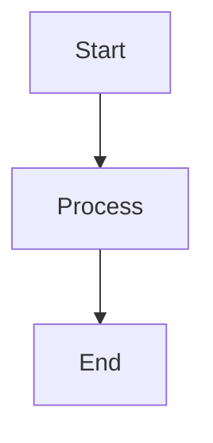
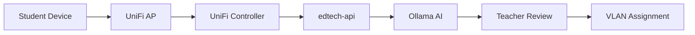

# Contributing to UniFi Edtech Stack

🎉 **Thank you for your interest in contributing!** This project thrives on collaboration between educators, network operators, and AI enthusiasts who believe technology should **enhance human insight**, not replace it.

---

## 🎯 Project Philosophy

Before contributing, understand our core values:

- **Human-AI Balance**: AI suggests, humans decide. No autonomous network changes.
- **Classroom Empathy**: Designed for flaky student devices and on-prem constraints.
- **Pragmatic Fortress**: Security without ceremony, modularity without bloat.
- **Docs-First**: If it's not versioned and documented, it didn't happen.
- **Test on Real Hardware**: Pi5 validation > theoretical perfection.

**Ask yourself**: Does this contribution **enhance** teacher/admin insight, or does it try to **replace** their judgment?

---

## 🚀 Getting Started

### Prerequisites

- **Hardware**: Raspberry Pi 5 (8GB) or compatible aarch64 system
- **OS**: Raspberry Pi OS Lite (64-bit) - Bookworm (Debian 12) or newer
- **Skills**: Bash, Docker Compose, Python (for API work), basic networking

### Setup Development Environment

1. **Fork the repository**
   ```bash
   # On GitHub, click "Fork" button
   ```

2. **Clone your fork**
   ```bash
   git clone https://github.com/YOUR_USERNAME/unifi-edtech-stack.git
   cd unifi-edtech-stack
   ```

3. **Install pre-commit hooks** (automated code quality)
   ```bash
   pip install pre-commit
   pre-commit install
   ```

4. **Create a feature branch**
   ```bash
   git checkout -b feature/your-feature-name
   ```

5. **Make your changes** (see sections below)

6. **Test on Pi** (critical!)
   ```bash
   # Deploy to actual Pi5 hardware
   sudo bash scripts/first-run.sh
   cd docker && docker compose up -d
   
   # Run integration tests
   cd tests && pytest -v
   ```

7. **Submit Pull Request** (see PR guidelines below)

---

## 📝 Types of Contributions

### 🐛 Bug Reports

**Before filing**:
- Check [existing issues](https://github.com/T-Rylander/unifi-edtech-stack/issues)
- Reproduce on Pi5 hardware (not dev machine simulation)
- Collect logs: `~/unifi-logs/setup.log`, `docker compose logs`

**Bug Report Template**:
```markdown
## Bug Description
Brief description of the issue.

## Environment
- **Hardware**: Raspberry Pi 5 (8GB)
- **OS**: Raspberry Pi OS Bookworm (64-bit)
- **Docker**: 24.x
- **Compose**: v2.24+

## Steps to Reproduce
1. Run `sudo bash scripts/first-run.sh`
2. Deploy with `docker compose up -d`
3. Observe error at...

## Expected Behavior
Service should start healthy.

## Actual Behavior
Service shows unhealthy in `docker compose ps`.

## Logs
```
<paste relevant logs>
```

## Additional Context
Temperature, network config, etc.
```

### 💡 Feature Requests

**Alignment Check**:
- Does this feature **augment** human decision-making?
- Can it run on Pi5 hardware (no cloud dependencies)?
- Is it documented in a phase of [PHASED-ROADMAP.md](docs/PHASED-ROADMAP.md)?

**Feature Request Template**:
```markdown
## Feature Description
Brief description of the proposed feature.

## Use Case
Educational scenario where this helps teachers/admins.

## Proposed Solution
Technical approach (Bash script, Docker service, Python API, etc.).

## Human-AI Balance
How does this ensure teacher override/approval?

## Classroom Impact
How does this help manage flaky student devices or on-prem constraints?

## Testing Plan
How will you validate this on Pi5 hardware?
```

### 🔧 Pull Requests

**Before submitting**:
- [ ] Code follows project conventions (see Style Guide below)
- [ ] Tests pass: `pytest tests/ -v`
- [ ] Shellcheck clean: `shellcheck scripts/*.sh`
- [ ] Documentation updated (README, relevant docs/)
- [ ] CHANGELOG.md updated under `[Unreleased]` section
- [ ] Tested on actual Pi5 hardware (not just dev machine)
- [ ] Human-AI boundary respected (no autonomous changes)

**PR Template** (auto-populated):
```markdown
## Description
Brief description of changes.

## Type of Change
- [ ] Bug fix (non-breaking)
- [ ] New feature (non-breaking)
- [ ] Breaking change (document in CHANGELOG.md)
- [ ] Documentation update

## Testing
- [ ] Tested on Raspberry Pi 5 (8GB)
- [ ] All tests pass: `pytest -v`
- [ ] Shellcheck clean: `shellcheck scripts/*.sh`
- [ ] Docker Compose validates: `docker compose config`

## Checklist
- [ ] Code follows style guide
- [ ] Documentation updated
- [ ] CHANGELOG.md updated
- [ ] Human-AI balance maintained (teacher override preserved)
- [ ] Classroom-empathetic (works with flaky devices)

## Related Issues
Fixes #123, Addresses #456
```

---

## 🎨 Style Guide

### Bash Scripts

**Conventions**:
- Use `#!/bin/bash` (not `#!/bin/sh`)
- Strict mode: `set -euo pipefail`
- Functions before main logic
- Logging: `log "LEVEL" "message"` pattern
- Error handling: explicit exit codes
- Idempotency: safe to run multiple times

**Example**:
```bash
#!/bin/bash
set -euo pipefail

readonly LOGFILE="~/unifi-logs/script.log"

log() {
    local level=$1
    shift
    echo "$(date '+%Y-%m-%d %H:%M:%S') [$level] $*" | tee -a "$LOGFILE"
}

main() {
    log "INFO" "Starting script..."
    # Logic here
    log "INFO" "Script complete"
}

main "$@"
```

**Validation**:
```bash
shellcheck scripts/your-script.sh
```

### Python (for edtech-api)

**Conventions**:
- PEP 8 compliant (enforced by pre-commit)
- Type hints where reasonable
- Docstrings for public functions
- Flask routes with error handling
- Ollama queries logged for audit

**Example**:
```python
from flask import Flask, request, jsonify
import logging

app = Flask(__name__)
logger = logging.getLogger(__name__)

@app.route('/vlan-group', methods=['POST'])
def suggest_vlan_grouping():
    """
    Suggest VLAN grouping based on device metadata.
    
    Returns:
        JSON with grouping suggestion and confidence score.
    """
    try:
        data = request.get_json()
        # Process with Ollama
        suggestion = query_ollama(data)
        
        # Log for audit trail
        logger.info(f"AI Suggestion: {suggestion}")
        
        return jsonify(suggestion), 200
    except Exception as e:
        logger.error(f"Error in vlan-group: {e}")
        return jsonify({"error": str(e)}), 500
```

**Validation**:
```bash
pytest tests/ -v
black services/edtech-api/
```

### Docker Compose

**Conventions**:
- Version 3.8+ syntax
- Health checks for all services
- Logging limits (10MB × 3 files)
- External networks where appropriate
- Env file validation (`required: true`)

### Markdown Documentation

**Conventions**:
- ATX-style headers (`#` not `===`)
- 120 char line limit (relaxed for code blocks)
- Fenced code blocks with language tags
- Mermaid diagrams for complex flows
- Links use reference style for maintainability

**Example**:
```markdown
## Section Title

Description with [inline link](./docs/REFERENCE.md).

### Subsection

```bash
# Code example with language tag
docker compose up -d
```


```

---

## 🧪 Testing Guidelines

### Integration Tests (pytest)

**Location**: `tests/test_integration.py`

**Scope**:
- Docker Compose health checks
- Service endpoint validation
- Configuration file parsing
- Security posture checks (AppArmor, Fail2Ban)

**Running**:
```bash
cd tests
pytest -v                          # All tests
pytest test_integration.py -v     # Specific file
pytest -k "test_docker" -v        # Pattern match
```

### Manual Pi Testing

**Critical for PRs**:
1. Fresh Pi5 with Raspberry Pi OS Lite
2. Run `sudo bash scripts/first-run.sh`
3. Deploy: `cd docker && docker compose up -d`
4. Validate: Check all services healthy
5. Test feature: Your specific contribution
6. Collect logs: `~/unifi-logs/setup.log`

**Classroom Simulation** (Phase 2+):
- 10+ simulated student devices (iperf3, curl loops)
- Verify VLAN grouping suggestions
- Test AI prompt accuracy
- Monitor Pi temperature under load

---

## 📚 Documentation Standards

### When to Update Docs

**Always update**:
- README.md: If adding major feature
- CHANGELOG.md: Every PR (under `[Unreleased]`)
- Relevant docs/: If changing behavior
- Comments: If code intent isn't obvious

### Documentation Types

| Doc Type | Purpose | Example |
|----------|---------|---------|
| **Guide** | Step-by-step instructions | FIRST-RUN.md |
| **Reference** | Technical specs | AI-ROADMAP.md |
| **Status** | Current state | PROJECT-STATUS.md |
| **Roadmap** | Future plans | PHASED-ROADMAP.md |

### Mermaid Diagrams

**Use for**:
- Boot sequences (first-run.sh flow)
- Service dependencies (docker-compose health chains)
- Decision trees (troubleshooting)
- Network topologies (Swarm overlay)

**Example**:
```markdown

```

---

## 🔒 Security Guidelines

### Secrets Management

**Never commit**:
- API keys, passwords, tokens
- SSH private keys
- WireGuard private keys
- Student PII (even in logs)

**Use instead**:
- Environment variables in `config.env`
- Docker secrets (for Swarm)
- `.gitignore` for sensitive files

### PII Handling (Critical for AI)

When working with Ollama/AI features:

1. **Sanitize logs** before training:
   - MAC addresses → hashed IDs
   - Student names → generic labels
   - IP addresses → subnet masks

2. **Audit trail**: All AI suggestions logged to `~/unifi-logs/ai-decisions.log`

3. **Human veto**: Teacher approval required for network changes

**Example Sanitization**:
```python
import hashlib

def sanitize_mac(mac: str) -> str:
    """Convert MAC address to hashed ID"""
    return f"device-{hashlib.sha256(mac.encode()).hexdigest()[:8]}"

# Before: "AA:BB:CC:DD:EE:FF connected to lab-101"
# After: "device-a1b2c3d4 connected to lab-101"
```

---

## 🏷️ Commit Message Conventions

We use [Conventional Commits](https://www.conventionalcommits.org/) for automated changelog generation.

### Format

```
<type>(<scope>): <subject>

[optional body]

[optional footer]
```

### Types

- `feat:` New feature
- `fix:` Bug fix
- `docs:` Documentation only
- `style:` Formatting (no code change)
- `refactor:` Code restructure (no behavior change)
- `test:` Adding/fixing tests
- `chore:` Maintenance (deps, config)

### Examples

```bash
feat(api): Add VLAN grouping endpoint with Ollama integration

Implements Phase 2.1 from PHASED-ROADMAP.md.
POST /vlan-group accepts device list, queries Ollama for suggestions,
returns JSON with confidence scores.

Fixes #42

---

fix(first-run): Retry Docker installation on network timeout

Adds 3-retry loop with 10s backoff for curl | sh failures.

---

docs(security): Add PII sanitization guidelines for AI training

Details MAC hashing, student name masking, IP anonymization.
```

---

## 🤝 Code Review Process

### What Reviewers Look For

1. **Human-AI Balance**: Does AI stay in "suggest" mode?
2. **Pi5 Tested**: Did contributor test on real hardware?
3. **Classroom Empathy**: Does it handle flaky devices?
4. **Security**: No secrets committed, PII sanitized?
5. **Documentation**: CHANGELOG updated, README accurate?
6. **Style**: Shellcheck clean, pytest passes?

### Approval Criteria

- ✅ At least 1 maintainer approval
- ✅ All CI checks pass (shellcheck, markdown-lint, docker validate)
- ✅ Human-AI boundary respected
- ✅ Tested on Pi5 hardware

### Merge Strategy

- **Squash and merge** for feature branches
- **Rebase and merge** for hotfixes
- **Delete branch** after merge

---

## 🎓 Learning Resources

### Project-Specific

- [PROJECT-STATUS.md](docs/PROJECT-STATUS.md) - Current state and gaps
- [PHASED-ROADMAP.md](docs/PHASED-ROADMAP.md) - Implementation phases
- [AI-ROADMAP.md](docs/AI-ROADMAP.md) - Ollama integration details
- [TROUBLESHOOTING.md](TROUBLESHOOTING.md) - Common issues

### External References

- [Docker Compose Documentation](https://docs.docker.com/compose/)
- [UniFi API Unofficial Wiki](https://ubntwiki.com/products/software/unifi-controller/api)
- [Ollama Documentation](https://ollama.ai/docs)
- [pytest Documentation](https://docs.pytest.org/)
- [Conventional Commits](https://www.conventionalcommits.org/)

---

## 📞 Getting Help

### Communication Channels

- **GitHub Issues**: Bug reports, feature requests
- **Pull Requests**: Code review discussions
- **Discussions** (if enabled): General questions, ideas

### Response Times

- **Maintainer**: Travis Rylander (@T-Rylander)
- **Expected response**: 48-72 hours
- **Urgent security issues**: See [SECURITY.md](SECURITY.md)

---

## 🏆 Recognition

Contributors are acknowledged in:
- README.md "Acknowledgments" section
- CHANGELOG.md release notes
- Git commit history

Special recognition for:
- Classroom pilot testing and feedback
- AI fine-tuning contributions (sanitized datasets)
- Multi-Pi Swarm validation

---

## 📜 License

By contributing, you agree that your contributions will be licensed under the MIT License.

See [LICENSE](LICENSE) file for details.

---

**Remember**: "Because nothing says 'classroom ready' like a Pi that doesn't melt under 30 Chromebooks." 🍓🔥

**Questions?** File an issue or start a discussion. We're here to help educators build better learning environments, together.
