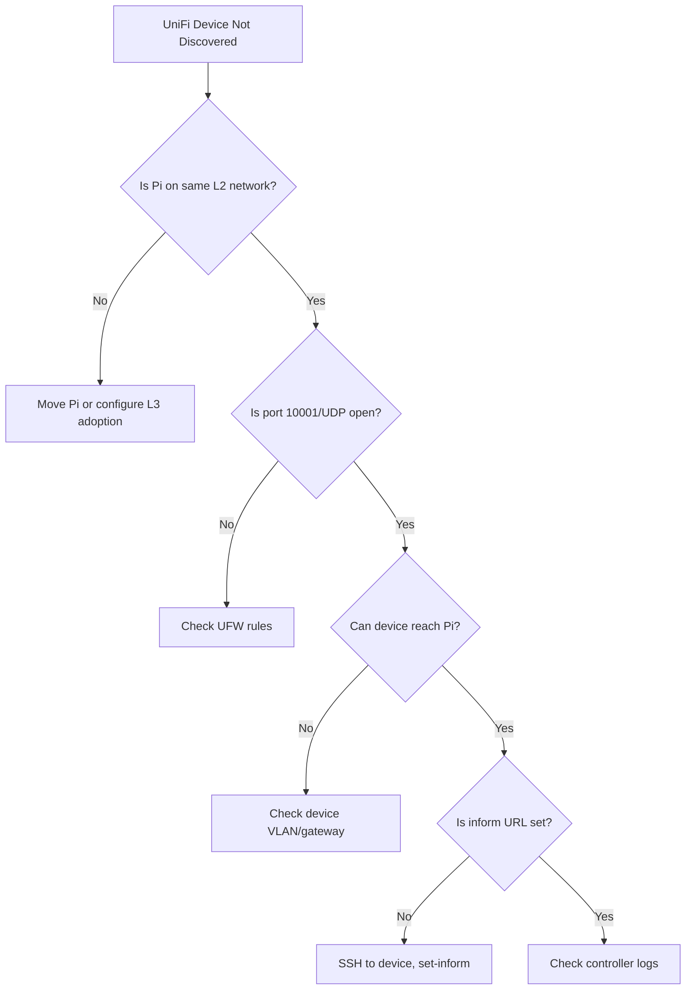
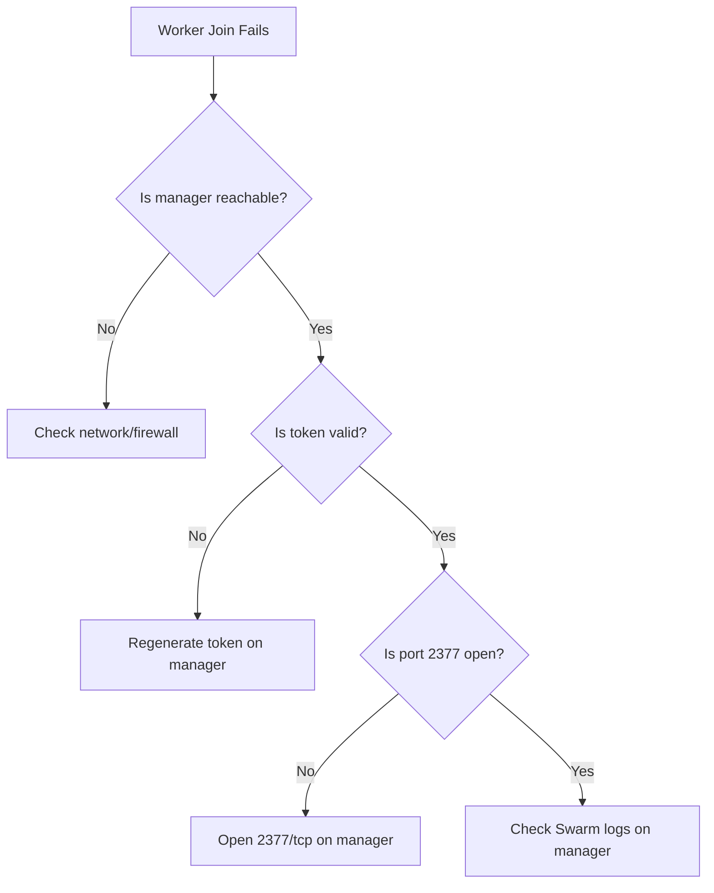
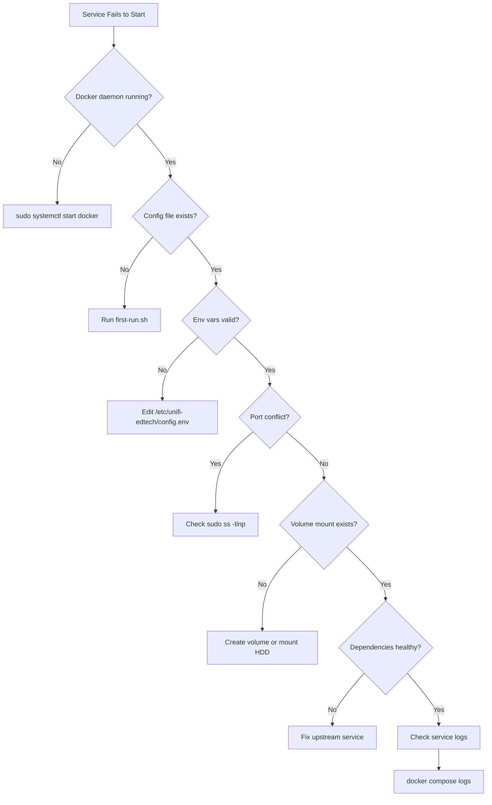
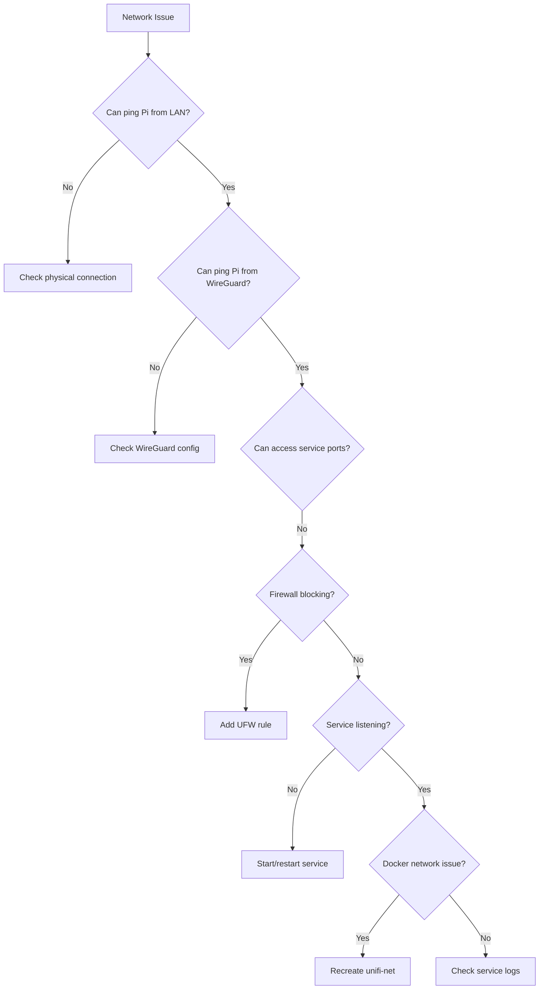

# Troubleshooting Guide

This document lists **common issues** and their **solutions** when setting up and using the **unifi-edtech-stack**. For setup guidance, see [FIRST-RUN.md](docs/FIRST-RUN.md).

---

## 🧭 Quick Navigation

- [Initial Setup Issues](#-initial-setup-issues)
- [Docker & Compose Issues](#-docker--compose-issues)
- [UniFi Controller Issues](#-unifi-controller-issues)
- [WireGuard Issues](#-wireguard-issues)
- [Swarm Mode Issues](#-swarm-mode-issues)
- [AI/Ollama Issues](#-aiollama-issues)
- [Performance Issues](#-performance-issues)
- [Troubleshooting Flowchart](#-troubleshooting-flowchart)

---

## 🚀 Initial Setup Issues

### 1. **SSH Access Fails After First Run**

**Symptoms**:
- Cannot SSH with password after running `first-run.sh`
- "Permission denied (publickey)" error

**Root Cause**: Script hardened SSH config to disable password authentication.

**Fix**:
```bash
# On your local machine, copy SSH key to Pi
ssh-copy-id -i ~/.ssh/id_ed25519.pub pi@<PI_IP>

# Or manually add key to authorized_keys
cat ~/.ssh/id_ed25519.pub | ssh pi@<PI_IP> "mkdir -p ~/.ssh && cat >> ~/.ssh/authorized_keys"

# Test SSH connection
ssh -i ~/.ssh/id_ed25519 pi@<PI_IP>
```

**Prevention**: Run `first-run.sh` with your SSH key already configured, or use the `--skip-ssh-hardening` flag during initial testing.

### 2. **Script Fails with "Config file already exists"**

**Symptoms**:
- `first-run.sh` exits early
- Message: "/etc/unifi-edtech/config.env already exists"

**Root Cause**: Script detects existing configuration to prevent accidental overwrites.

**Fix**:
```bash
# Backup existing config
sudo cp /etc/unifi-edtech/config.env /etc/unifi-edtech/config.env.backup

# Remove config to force regeneration
sudo rm /etc/unifi-edtech/config.env

# Re-run first-run script
sudo bash scripts/first-run.sh
```

**Alternative**: Edit `/etc/unifi-edtech/config.env` manually with your preferred settings.

### 3. **Docker Installation Fails**

**Symptoms**:
- Script hangs at "Installing Docker..."
- curl errors or network timeouts

**Root Cause**: Network connectivity issues or Docker repo unavailable.

**Fix**:
```bash
# Test internet connectivity
ping -c 3 get.docker.com

# Manual Docker installation
sudo apt-get update
sudo apt-get install -y ca-certificates curl gnupg
sudo install -m 0755 -d /etc/apt/keyrings
curl -fsSL https://download.docker.com/linux/debian/gpg | sudo gpg --dearmor -o /etc/apt/keyrings/docker.gpg
sudo chmod a+r /etc/apt/keyrings/docker.gpg

echo \
  "deb [arch=$(dpkg --print-architecture) signed-by=/etc/apt/keyrings/docker.gpg] https://download.docker.com/linux/debian \
  $(. /etc/os-release && echo "$VERSION_CODENAME") stable" | \
  sudo tee /etc/apt/sources.list.d/docker.list > /dev/null

sudo apt-get update
sudo apt-get install -y docker-ce docker-ce-cli containerd.io docker-buildx-plugin docker-compose-plugin
```

---

## 🐳 Docker & Compose Issues

### 4. **Services Show "Unhealthy" Status**

**Symptoms**:
- `docker compose ps` shows services as "unhealthy"
- Health checks failing repeatedly

**Diagnosis**:
```bash
# Check service logs
cd docker
docker compose logs wireguard
docker compose logs unifi-controller
docker compose logs ollama

# Inspect health check details
docker inspect unifi-controller | grep -A 10 Health
```

**Common Causes**:

**WireGuard Unhealthy**:
```bash
# Check if interface exists
docker exec wireguard wg show

# Verify kernel modules
lsmod | grep wireguard

# Fix: Restart service
docker compose restart wireguard
```

**UniFi Controller Unhealthy**:
```bash
# Check if port 8443 is listening
docker exec unifi-controller netstat -tlnp | grep 8443

# Check JVM memory (may need adjustment)
docker exec unifi-controller ps aux | grep java

# Fix: Increase JVM heap in config.env
sudo nano /etc/unifi-edtech/config.env
# Set: JVM_MAX_HEAP_SIZE=2048M
docker compose up -d --force-recreate
```

**Ollama Unhealthy**:
```bash
# Test API endpoint
curl http://localhost:11434/api/version

# Check if model is loaded
docker exec ollama ollama list

# Fix: Pull missing model
docker exec ollama ollama pull llama3:8b
```

### 5. **Docker Volume Mounts Fail**

**Symptoms**:
- Services fail to start
- Errors like "failed to mount" or "permission denied"

**Root Cause**: External HDD not mounted or incorrect permissions.

**Fix**:
```bash
# Check if HDD is mounted
df -h | grep /mnt/hdd

# Mount HDD manually
sudo mount /dev/sda1 /mnt/hdd

# Make permanent in fstab
echo "UUID=$(sudo blkid -s UUID -o value /dev/sda1) /mnt/hdd ext4 defaults 0 2" | sudo tee -a /etc/fstab
sudo mount -a

# Fix permissions
sudo chown -R root:docker /mnt/hdd/unifi-data
sudo chmod -R 770 /mnt/hdd/unifi-data
```

### 6. **env_file Validation Errors**

**Symptoms**:
- `docker compose up` fails with "required config not found"
- Error: "environment variable X not set"

**Root Cause**: Docker Compose v2.24+ requires `env_file.required: true` variables to exist.

**Fix**:
```bash
# Validate config exists
test -f /etc/unifi-edtech/config.env && echo "Config found" || echo "Config missing"

# Check for required variables
grep -E "^(PUID|PGID|TZ|HOST_IP|WG_SERVERPORT)" /etc/unifi-edtech/config.env

# Regenerate config
sudo bash scripts/first-run.sh

# Manual fix: Edit config directly
sudo nano /etc/unifi-edtech/config.env
```

---

## 🌐 UniFi Controller Issues

### 7. **UniFi Discovery Fails**

**Symptoms**:
- UniFi devices not discovered by controller
- Devices show "Disconnected" or "Pending Adoption"

**Diagnosis Flowchart**:


**Fix**:
```bash
# Ensure L2 discovery (UDP 10001) is allowed
sudo ufw allow 10001/udp from 192.168.2.0/24

# Check if controller is listening
sudo ss -tulnp | grep 10001

# SSH to UniFi device and set inform URL
ssh ubnt@<DEVICE_IP>
# Password: ubnt (default)
set-inform http://<PI_IP>:8080/inform

# Verify in controller logs
docker compose logs unifi-controller | grep -i adopt
```

### 8. **Infinite Adoption Loop**

**Symptoms**:
- Device adopts, then disconnects, then adopts again
- Logs show "inform error" or "connection refused"

**Root Cause**: Inform URL resolves to incorrect IP after routing changes.

**Fix**:
```bash
# From UniFi device console
set-inform http://192.168.2.100:8080/inform

# Or via SSH (persistent)
ssh ubnt@<DEVICE_IP>
mca-cli set-inform http://192.168.2.100:8080/inform

# Verify UDP 10001 reachability
nmap -sU -p 10001 <PI_IP>

# Check controller logs for errors
docker compose logs unifi-controller | tail -50
```

### 9. **Controller Web UI Not Accessible**

**Symptoms**:
- Cannot access `https://<PI_IP>:8443`
- Browser shows "Connection Refused"

**Fix**:
```bash
# Check if container is running
docker compose ps

# Check if port 8443 is exposed
sudo ss -tlnp | grep 8443

# Test from Pi itself
curl -k https://localhost:8443

# Check firewall
sudo ufw status | grep 8443
sudo ufw allow 8443/tcp from 192.168.2.0/24

# Restart controller
docker compose restart unifi-controller
```

---

## 🔒 WireGuard Issues

### 10. **WireGuard Tunnel Not Working**

**Symptoms**:
- Cannot connect via WireGuard VPN
- Handshake fails or times out

**Diagnosis**:
```bash
# Check if WireGuard is running
docker compose ps wireguard

# Check interface status
docker exec wireguard wg show

# Test connectivity from Pi
ping -c 3 10.13.13.1

# Check UFW rule
sudo ufw status | grep 51820
```

**Fix**:
```bash
# Ensure UDP 51820 is allowed
sudo ufw allow 51820/udp

# Restart WireGuard
docker compose restart wireguard

# Regenerate peer config if needed
docker exec wireguard cat /config/peer1/peer1.conf

# On client, test with verbose logging
sudo wg-quick up wg0 --debug
```

### 11. **Cannot Access UniFi Through WireGuard**

**Symptoms**:
- WireGuard connects, but cannot reach `https://10.13.13.2:8443`

**Root Cause**: Routing or firewall misconfiguration.

**Fix**:
```bash
# Verify WireGuard client routes
ip route show | grep 10.13.13.0

# From WireGuard client, test UniFi reachability
ping 10.13.13.2
curl -k https://10.13.13.2:8443

# Check Docker network
docker network inspect unifi-net

# Ensure UniFi container is on correct network
docker compose down
docker compose up -d
```

---

## 🐝 Swarm Mode Issues

### 12. **Swarm Initialization Fails**

**Symptoms**:
- `swarm-init.sh` exits with error
- "docker swarm init" fails

**Fix**:
```bash
# Check if already in Swarm
docker info | grep "Swarm: active"

# If stuck in error state, force leave
docker swarm leave --force

# Re-initialize with explicit advertise address
docker swarm init --advertise-addr <PI_IP>

# Verify Swarm status
docker node ls
```

### 13. **Worker Node Cannot Join Swarm**

**Symptoms**:
- `docker swarm join` fails on worker node
- "invalid join token" or "connection refused"

**Diagnosis Flowchart**:


**Fix**:
```bash
# On manager, regenerate worker token
docker swarm join-token worker

# Ensure port 2377/tcp is open
sudo ufw allow 2377/tcp from 192.168.2.0/24

# On worker, use full join command
docker swarm join --token <TOKEN> <MANAGER_IP>:2377

# Verify from manager
docker node ls
```

### 14. **Join Token Expired**

**Symptoms**:
- Worker join fails with "token expired"

**Root Cause**: Swarm tokens rotate after 90 days by default.

**Fix**:
```bash
# On manager, regenerate token
docker swarm join-token --rotate worker

# Copy new token from output
docker swarm join-token worker

# On worker, leave and rejoin
docker swarm leave
docker swarm join --token <NEW_TOKEN> <MANAGER_IP>:2377
```

### 15. **Overlay Network Issues**

**Symptoms**:
- Services on different nodes cannot communicate
- "no route to host" errors

**Fix**:
```bash
# Ensure UDP 4789 (VXLAN) and TCP/UDP 7946 (Serf) are open
sudo ufw allow 4789/udp from 192.168.2.0/24
sudo ufw allow 7946 from 192.168.2.0/24

# Check overlay networks
docker network ls --filter driver=overlay

# Inspect network connectivity
docker network inspect <OVERLAY_NETWORK_NAME>

# Restart Docker daemon if needed
sudo systemctl restart docker
```

---

## 🤖 AI/Ollama Issues

### 16. **Ollama Container Won't Start**

**Symptoms**:
- Ollama container exits immediately
- "Out of memory" or "failed to allocate" errors

**Root Cause**: Insufficient RAM or model too large for Pi5.

**Fix**:
```bash
# Check available memory
free -h

# Use smaller model (4B instead of 8B)
docker exec ollama ollama pull llama3:4b

# Limit Ollama memory usage (in Modelfile)
docker exec ollama sh -c 'cat > /tmp/Modelfile <<EOF
FROM llama3:4b
PARAMETER num_ctx 2048
PARAMETER num_gpu 0
EOF'

docker exec ollama ollama create llama3-light -f /tmp/Modelfile
```

### 17. **Ollama API Returns Slow Responses**

**Symptoms**:
- Query takes >30 seconds
- Pi temperature exceeds 80°C

**Fix**:
```bash
# Check Pi temperature
vcgencmd measure_temp

# Reduce model context window
# In Modelfile: PARAMETER num_ctx 1024

# Use quantized model
docker exec ollama ollama pull llama3:4b-q4_0

# Monitor CPU/memory usage
docker stats ollama
```

### 18. **AI Suggestions Not Appearing in edtech-api**

**Symptoms**:
- `/vlan-group` endpoint returns errors
- Logs show "Ollama connection refused"

**Fix**:
```bash
# Verify Ollama is healthy
curl http://localhost:11434/api/version

# Check if edtech-api can reach Ollama
docker exec edtech-api curl http://ollama:11434/api/version

# Ensure services are on same network
docker network inspect unifi-net

# Restart edtech-api
docker compose restart edtech-api
```

---

## ⚡ Performance Issues

### 19. **Pi Overheating / Thermal Throttling**

**Symptoms**:
- Temperature >80°C
- `vcgencmd get_throttled` shows throttling flags
- Services become sluggish

**Fix**:
```bash
# Check current temperature
vcgencmd measure_temp

# Check throttling status
vcgencmd get_throttled
# 0x0 = No throttling (good)
# 0x50000 = Currently throttled

# Immediate cooling
# - Ensure fan is running
# - Remove case temporarily
# - Reduce load (stop Ollama)

docker compose --profile ai down

# Long-term solutions
# - Add active cooling (ICE Tower, 52Pi cooler)
# - Reduce JVM heap for UniFi
# - Disable Ollama unless needed
```

### 20. **Disk Space Exhausted**

**Symptoms**:
- `docker compose up` fails with "no space left on device"
- Logs show "write failed"

**Fix**:
```bash
# Check disk usage
df -h

# Find large Docker artifacts
docker system df

# Clean up
docker system prune -af --volumes

# Limit log sizes (already in compose.yml)
# - driver: json-file
# - max-size: 10m
# - max-file: 3

# Move Docker data to external HDD
sudo systemctl stop docker
sudo mv /var/lib/docker /mnt/hdd/docker
sudo ln -s /mnt/hdd/docker /var/lib/docker
sudo systemctl start docker
```

### 21. **Database Corruption (UniFi)**

**Symptoms**:
- UniFi controller fails to start
- Logs show "MongoDB error" or "corrupted database"

**Fix**:
```bash
# Stop controller
docker compose stop unifi-controller

# Backup data
sudo cp -r /mnt/hdd/unifi-data /mnt/hdd/unifi-data.backup

# Repair MongoDB
docker run --rm -v /mnt/hdd/unifi-data:/data mongo:4.4 mongod --repair

# Restart controller
docker compose up -d unifi-controller

# If still fails, restore from backup
sudo rm -rf /mnt/hdd/unifi-data
sudo cp -r /mnt/hdd/unifi-data.backup /mnt/hdd/unifi-data
docker compose up -d unifi-controller
```

---

## 🔍 Troubleshooting Flowchart

### Service Won't Start



### Network Connectivity Issues



---

## 📌 Best Practices

### Before Filing an Issue

1. **Check existing issues**: [GitHub Issues](https://github.com/T-Rylander/unifi-edtech-stack/issues)
2. **Reproduce on fresh Pi**: Ensure it's not environment-specific
3. **Collect logs**:
   ```bash
   # Setup logs
   cat ~/unifi-logs/setup.log
   
   # Service logs
   docker compose logs --tail=100
   
   # System logs
   sudo journalctl -u docker --since "1 hour ago"
   ```
4. **Include environment details**:
   - Pi model (5, 4, etc.)
   - OS version: `cat /etc/os-release`
   - Docker version: `docker --version`
   - Compose version: `docker compose version`
5. **Sanitize PII**: Remove MAC addresses, student names, IP addresses

### Debugging Commands

```bash
# Service status
docker compose ps

# Live logs
docker compose logs -f

# Container inspection
docker inspect <CONTAINER_NAME>

# Network inspection
docker network inspect unifi-net

# Resource usage
docker stats

# Test connectivity
curl -k https://localhost:8443
curl http://localhost:11434/api/version

# Pi diagnostics
vcgencmd measure_temp
vcgencmd get_throttled
df -h
free -h
```

---

## 🔗 Related Documentation

- [FIRST-RUN.md](docs/FIRST-RUN.md) - Initial setup guide
- [DOCKER-SWARM.md](docs/DOCKER-SWARM.md) - Multi-node clustering
- [SECURITY.md](SECURITY.md) - Vulnerability disclosure
- [AI-ROADMAP.md](docs/AI-ROADMAP.md) - Ollama integration details
- [CONTRIBUTING.md](CONTRIBUTING.md) - How to report issues

---

**Still stuck?** Open an issue with logs, steps to reproduce, and environment details. We're here to help!