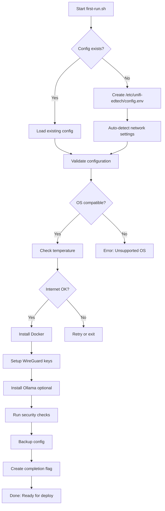

# 📌 FIRST-RUN.md — Raspberry Pi 5 Boot and Hardening Guide

This document provides comprehensive guidance for **provisioning**, **deploying**, and **validating** your **Raspberry Pi 5 (8GB)** as a UniFi Edtech Stack node.

---

## 📑 Table of Contents

1. [Initial Boot & Hardening Checklist](#-initial-boot--hardening-checklist)
2. [Running first-run.sh](#-running-first-runsh)
3. [Post-Boot Validation](#-post-boot-validation)
4. [Deploying the Stack](#-deploying-the-stack)
5. [Human-AI Onboarding](#-human-ai-onboarding)
6. [Troubleshooting Guide](#-troubleshooting-guide)
7. [Next Steps](#-next-steps)

---

## 🧰 Initial Boot & Hardening Checklist

### Prerequisites
- **Hardware**: Raspberry Pi 5 (8GB RAM recommended)
- **Storage**: 64GB+ microSD or NVMe SSD (SA400S37/120G via USB-to-SATA works great)
- **Network**: Ethernet connection (Gigabit preferred)
- **OS**: Raspberry Pi OS Lite (64-bit) - Bookworm or Trixie

### Manual Setup Steps (if not using first-run.sh)

| Step | Action | Command | Notes |
|------|--------|---------|-------|
| 1 | Set Hostname | `sudo raspi-config nonint do_hostname unifi-pi` | Sets the Pi's hostname |
| 2 | Set Timezone | `sudo raspi-config nonint do_change_timezone America/Chicago` | Adjust to your timezone |
| 3 | Enable SSH and Disable Password Auth | `sudo raspi-config nonint do_ssh 0`<br>`sudo sed -i 's/#PasswordAuthentication yes/PasswordAuthentication no/' /etc/ssh/sshd_config`<br>`sudo systemctl restart ssh` | Ensures secure SSH access |
| 4 | Set Static IP | `sudo raspi-config nonint do_network_set_static_ip 192.168.1.52 192.168.1.1 255.255.255.0` | Sets a static IP for the Pi |
| 5 | Update and Upgrade | `sudo apt update && sudo apt full-upgrade -y` | Installs latest OS patches |
| 6 | Reboot | `sudo reboot` | Applies all changes |
| 7 | Mount HDD (Optional) | `sudo blkid | grep "EDTECH-HDD" | cut -d '"' -f2 | xargs -I {} sudo mount {} /mnt/hdd`<br>`echo "UUID=YOUR_HDD_UUID /mnt/hdd auto defaults,nofail 0 2" | sudo tee -a /etc/fstab` | Mounts the SA400S37/120G HDD |
| 8 | Set Up Cron for Backups | `crontab -l 2>/dev/null; echo "0 2 * * * rsync -a /home/pi/unifi-backups /mnt/hdd/backups/" | crontab -` | Sets up daily backups |
| 9 | Enable Security Hardening | `sudo apt install -y fail2ban apparmor`<br>`sudo systemctl enable fail2ban`<br>`sudo systemctl start fail2ban` | Adds security layers |
| 10 | Clone Repo | `cd /home/pi && git clone https://github.com/T-Rylander/unifi-edtech-stack.git` | Get the stack code |

---

## 🚀 Running first-run.sh

The **first-run.sh** script automates most of the above steps plus Docker setup, WireGuard keys, and config generation.

### Quick Start

```bash
cd /home/pi/unifi-edtech-stack/scripts
sudo bash first-run.sh --auto-detect
```

### What It Does



### Options

- `--auto-detect`: Auto-detect network settings (IP, gateway, DNS)
- `--non-interactive`: Run without prompts (uses defaults)
- `--help`: Show usage information

### Logs

- **Setup Log**: `~/unifi-logs/setup.log`
- **Error Log**: `~/unifi-logs/error.log`
- **Config**: `/etc/unifi-edtech/config.env`

---

## ✅ Post-Boot Validation

After `first-run.sh` completes, validate the environment before deploying services.

### 1. Check System Status

```bash
# Verify OS and architecture
uname -a
# Expected: Linux unifi-pi 6.x.x-v8+ aarch64

# Check temperature (should be <60°C)
vcgencmd measure_temp

# Verify memory
free -h
# Expected: ~7.5GB total for Pi5 8GB

# Check disk space
df -h
# Ensure >10GB free for Docker images and logs
```

### 2. Validate Configuration

```bash
# Check config file exists and is readable
sudo cat /etc/unifi-edtech/config.env

# Verify key variables
grep -E "^(IP|HOSTNAME|DOCKER_NETWORK|WG_PORT)" /etc/unifi-edtech/config.env
```

**Expected Output**:
```bash
HOSTNAME="unifi-pi"
IP="192.168.1.52/24"
DOCKER_NETWORK="unifi-net"
WG_PORT=51820
```

### 3. Verify Docker

```bash
# Check Docker version
docker --version
# Expected: Docker version 24.x or newer

# Verify Docker Compose
docker compose version
# Expected: Docker Compose version v2.24 or newer

# Test Docker engine
docker run --rm hello-world
# Should pull and run successfully

# Check Docker network
docker network inspect unifi-net
# Should exist with bridge driver
```

### 4. Verify WireGuard Keys

```bash
# Check keys exist
sudo ls -la /etc/wireguard/
# Expected: private.key and public.key with 600 perms

# Show public key (for peer config)
sudo cat /etc/wireguard/public.key
```

### 5. Check Security

```bash
# Verify AppArmor
sudo aa-status --enabled && echo "AppArmor enabled" || echo "AppArmor disabled"

# Check Fail2Ban
sudo systemctl status fail2ban
# Should show "active (running)"

# Verify SSH config
grep "PasswordAuthentication" /etc/ssh/sshd_config
# Should show: PasswordAuthentication no
```

---

## 🐳 Deploying the Stack

### Standard Deployment (WireGuard + UniFi)

```bash
cd /home/pi/unifi-edtech-stack/docker
docker compose up -d
```

**Wait ~90 seconds** for UniFi Controller to fully start (first boot takes longer).

### With AI (Ollama)

```bash
docker compose --profile ai up -d
```

### Verify Services

```bash
# Check all services are healthy
docker compose ps

# Expected output:
# NAME                    STATUS              PORTS
# unifi-wg-tunnel         Up (healthy)        51820/udp
# unifi-controller        Up (healthy)        8080, 8443, 3478/udp, ...
# ollama-ai               Up (healthy)        11434  (if --profile ai)
```

### View Logs

```bash
# All services
docker compose logs -f

# Specific service
docker compose logs -f unifi-controller

# Last 100 lines
docker compose logs --tail=100 unifi-controller

# Follow Ollama (if enabled)
docker compose logs -f ollama-ai
```

### Access UniFi Controller

1. Open browser: `https://<pi-ip>:8443`
2. Accept self-signed certificate warning
3. Complete setup wizard:
   - Create admin account
   - Skip auto-optimize (we'll configure manually)
   - Name your site (e.g., "Edtech Lab")

---

## 🤖 Human-AI Onboarding

### Enable Ollama Service

If you didn't start with `--profile ai`, enable it now:

```bash
cd /home/pi/unifi-edtech-stack/docker
docker compose --profile ai up -d
```

### Pull a Model

```bash
# Pull LLaMA3 (recommended for Pi5)
docker exec ollama-ai ollama pull llama3

# Verify model is available
docker exec ollama-ai ollama list
```

### Test AI Query

```bash
# Simple test
curl http://localhost:11434/api/generate -d '{
  "model": "llama3",
  "prompt": "Hello, can you help with network operations?",
  "stream": false
}'
```

### Edtech Prompt Examples

#### 1. VLAN Grouping Suggestion

```bash
curl http://localhost:11434/api/generate -d '{
  "model": "llama3",
  "prompt": "I have 15 student devices connected to SSID lab-101. Devices have varied signal strengths: 5 at -50dBm, 7 at -65dBm, 3 at -80dBm. Suggest VLAN grouping to balance network load and ensure reliable connectivity.",
  "stream": false
}' | jq -r '.response'
```

**Example AI Response**:
```
Based on signal strength, I recommend:
- VLAN 101 (Strong Signal): 5 devices at -50dBm
- VLAN 102 (Medium Signal): 7 devices at -65dBm  
- VLAN 103 (Weak Signal): 3 devices at -80dBm

Consider moving weak-signal devices closer to AP or adding repeater.
```

#### 2. Device Troubleshooting

```bash
curl http://localhost:11434/api/generate -d '{
  "model": "llama3",
  "prompt": "UniFi log shows: AP dropped 3 devices in last hour. All devices had signal around -80dBm before disconnect. Root cause analysis?",
  "stream": false
}' | jq -r '.response'
```

#### 3. Lab Pairing Strategy

```bash
curl http://localhost:11434/api/generate -d '{
  "model": "llama3",
  "prompt": "I have 20 student Chromebooks in a coding lab. 10 students are beginners, 10 are advanced. How should I pair them for collaborative work, considering network traffic patterns?",
  "stream": false
}' | jq -r '.response'
```

### Human Review Workflow

**Important**: AI suggestions should always be reviewed by educators before applying to network configs.

```
1. AI generates suggestion → Log to ~/unifi-logs/ai-decisions.log
2. Teacher reviews suggestion → Approves or overrides
3. Config change applied → Audit trail maintained
4. Monitor outcome → Feed back to AI training data
```

---

## 🛠️ Troubleshooting Guide

### Issue: first-run.sh fails with "Missing required dependencies"

**Cause**: Required commands not found (curl, docker, etc.)

**Fix**:
```bash
sudo apt update
sudo apt install -y curl sudo tee find awk grep sed ping
```

### Issue: Docker Compose fails with "env_file required"

**Cause**: Docker Compose version < v2.24 doesn't support `required: true`

**Fix**:
```bash
# Check version
docker compose version

# If < v2.24, update Docker
sudo apt update
sudo apt install -y docker-compose-plugin

# Or edit docker-compose.yml and remove "required: true" lines
```

### Issue: UniFi Controller not adopting devices

**Cause**: STUN or inform ports blocked

**Fix**:
```bash
# Verify ports are exposed
docker compose ps

# Check firewall
sudo ufw status
# If enabled, allow: 8080, 8443, 3478/udp, 10001/udp

# Test from another device
curl -k https://<pi-ip>:8443
```

### Issue: WireGuard tunnel down

**Cause**: Keys missing or interface not up

**Fix**:
```bash
# Check keys exist
sudo ls /etc/wireguard/

# Regenerate if missing
sudo mkdir -p /etc/wireguard
sudo sh -c 'wg genkey | tee /etc/wireguard/private.key | wg pubkey > /etc/wireguard/public.key'
sudo chmod 600 /etc/wireguard/private.key

# Restart service
docker compose restart wireguard
```

### Issue: Ollama models not loading

**Cause**: Volume permissions or insufficient disk space

**Fix**:
```bash
# Check disk space
df -h
# Ensure >5GB free for models

# Check volume exists
docker volume inspect ollama-models

# Re-pull model
docker exec ollama-ai ollama pull llama3
```

### Issue: Pi thermal throttling (temp >70°C)

**Cause**: Inadequate cooling under sustained load

**Fix**:
1. **Immediate**: Add active cooling (fan)
2. **Short-term**: Reduce load (disable Ollama profile)
3. **Long-term**: Install heatsink + case fan

```bash
# Monitor temperature
watch -n 2 'vcgencmd measure_temp'

# Check for throttling events
vcgencmd get_throttled
# 0x0 = no throttling
# 0x50000 = past throttling
```

### Issue: Services show "unhealthy" in docker compose ps

**Cause**: Healthcheck failing (service not responding)

**Fix**:
```bash
# Check logs for the unhealthy service
docker compose logs --tail=50 <service-name>

# Manually test healthcheck
# For UniFi:
curl -k https://localhost:8443

# For WireGuard:
docker exec unifi-wg-tunnel wg show

# For Ollama:
curl http://localhost:11434/api/tags

# Restart if needed
docker compose restart <service-name>
```

### QR Code Not Generated

**Cause**: qrencode not installed or ENABLE_QR=0

**Fix**:
```bash
# Check setting
grep ENABLE_QR /etc/unifi-edtech/config.env

# Install qrencode
sudo apt install -y qrencode

# Manually generate
sudo qrencode -o /etc/unifi-edtech/setup-complete.png "https://github.com/T-Rylander/unifi-edtech-stack/blob/main/docs/FIRST-RUN.md"
```

---

## 🎯 Next Steps

### After Successful Deployment

1. **Configure UniFi Controller**
   - Adopt your APs via web UI (https://<pi-ip>:8443)
   - Create WiFi networks and VLANs
   - Set up guest portal (optional)

2. **Multi-Node Swarm** (if scaling)
   - Run `scripts/swarm-init.sh` on this manager node
   - Join worker Pis using tokens from `/etc/unifi-edtech/swarm-*-token`
   - See [DOCKER-SWARM.md](DOCKER-SWARM.md) for details

3. **Enable AI Features** (if not already)
   - Pull custom `edtech-assist` model (when available)
   - Test prompt templates from [AI-ROADMAP.md](AI-ROADMAP.md)
   - Log AI suggestions for validation

4. **Set Up Monitoring** (Phase 3)
   - Add Prometheus + Grafana services
   - Create dashboards for network health
   - Configure alerts for anomalies

5. **Classroom Pilot**
   - Test with 10-20 student devices
   - Validate VLAN auto-grouping (when edtech-api is ready)
   - Gather feedback for AI fine-tuning

---

## 📚 Related Documentation

- **[PROJECT-STATUS.md](PROJECT-STATUS.md)** - Current health and goal coverage
- **[PHASED-ROADMAP.md](PHASED-ROADMAP.md)** - Implementation phases and next steps
- **[AI-ROADMAP.md](AI-ROADMAP.md)** - Ollama integration and fine-tuning guide
- **[DOCKER-SWARM.md](DOCKER-SWARM.md)** - Multi-node cluster setup
- **[SECURITY.md](SECURITY.md)** - Hardening guidelines
- **[TROUBLESHOOTING.md](../TROUBLESHOOTING.md)** - Extended troubleshooting

---

## 🤝 Need Help?

- **File an Issue**: [GitHub Issues](https://github.com/T-Rylander/unifi-edtech-stack/issues)
- **Check Logs**: `~/unifi-logs/setup.log` and `~/unifi-logs/error.log`
- **Community**: Share classroom pilot results (anonymized) via PR

---

**Remember**: "Because nothing says 'classroom ready' like a Pi that doesn't melt under 30 Chromebooks." 🍓🔥