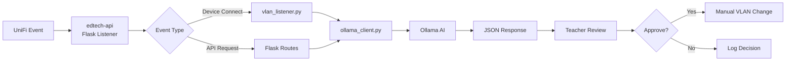

# Edtech API - AI-Augmented VLAN Management

Lightweight Flask API that bridges **UniFi Controller** events with **Ollama** AI suggestions for classroom network management.

---

## 🎯 Purpose

Provides **AI-powered insights** for teacher/admin network decisions:
- VLAN grouping suggestions based on device metadata
- Load balancing recommendations for multiple SSIDs
- Human-in-the-loop approval required (no autonomous changes)

---

## 🏗️ Architecture



---

## 🚀 Endpoints

### `GET /health`
Health check for Docker Compose.

**Response**:
```json
{
  "status": "healthy",
  "ollama_reachable": true,
  "unifi_reachable": true
}
```

### `POST /vlan-group`
Suggest VLAN grouping for device list.

**Request**:
```json
{
  "ssids": ["lab-101", "quiet-corner"],
  "devices": [
    {"mac": "AA:BB:CC:DD:EE:FF", "signal": -45, "hostname": "student-chromebook-12"},
    {"mac": "11:22:33:44:55:66", "signal": -72, "hostname": "ipad-08"}
  ]
}
```

**Response**:
```json
{
  "suggestion": {
    "lab-101": ["device-a1b2c3d4"],
    "quiet-corner": ["device-11223344"]
  },
  "confidence": 0.87,
  "reasoning": "Strong signal devices to lab-101, weak to quiet-corner for better load balance.",
  "human_review_required": true
}
```

### `GET /api/version`
API version info.

**Response**:
```json
{
  "api_version": "0.1.0",
  "ollama_version": "0.1.20"
}
```

---

## 🔧 Configuration

Environment variables (set in `/etc/unifi-edtech/config.env`):

| Variable | Default | Description |
|----------|---------|-------------|
| `OLLAMA_HOST` | `http://ollama:11434` | Ollama API endpoint |
| `UNIFI_HOST` | `https://unifi-controller:8443` | UniFi Controller URL |
| `API_KEY` | (required) | Auth key for API requests |
| `LOG_LEVEL` | `INFO` | Logging verbosity |
| `RATE_LIMIT` | `10/minute` | Max requests per client |

---

## 🧪 Testing

```bash
# Unit tests
cd services/edtech-api
pytest tests/ -v

# Integration test (requires Ollama running)
pytest tests/test_integration.py -v

# Manual API test
curl -X POST http://localhost:5000/vlan-group \
  -H "Content-Type: application/json" \
  -H "X-API-Key: your-api-key" \
  -d '{
    "ssids": ["lab-101", "quiet-corner"],
    "devices": [
      {"mac": "AA:BB:CC:DD:EE:FF", "signal": -45, "hostname": "device-1"}
    ]
  }'
```

---

## 🔐 Security

- **API key required**: Set `X-API-Key` header for all requests
- **Rate limiting**: 10 requests/minute per client (configurable)
- **PII sanitization**: MAC addresses hashed before logging
- **Audit trail**: All AI suggestions logged to `~/unifi-logs/ai-decisions.log`
- **Human approval**: No autonomous network changes

---

## 📂 File Structure

```
services/edtech-api/
├── app.py                 # Flask application entry point
├── vlan_listener.py       # UniFi event polling (optional)
├── ollama_client.py       # Ollama API wrapper
├── requirements.txt       # Python dependencies
├── Dockerfile             # Container build
├── tests/
│   ├── test_api.py        # API endpoint tests
│   ├── test_ollama.py     # Ollama client tests
│   └── test_integration.py # End-to-end tests
└── README.md              # This file
```

---

## 🏃 Running Locally (Development)

```bash
# Create virtual environment
python3 -m venv venv
source venv/bin/activate  # Linux/Mac
# OR
.\venv\Scripts\activate  # Windows

# Install dependencies
pip install -r requirements.txt

# Set environment variables
export OLLAMA_HOST=http://localhost:11434
export API_KEY=test-key-123

# Run Flask dev server
python app.py
```

---

## 🐳 Running in Docker

Managed by root `docker/docker-compose.yml`:

```yaml
edtech-api:
  build: ../services/edtech-api
  container_name: edtech-api
  env_file:
    - path: /etc/unifi-edtech/config.env
      required: true
  networks:
    - unifi-net
  ports:
    - "5000:5000"
  depends_on:
    ollama:
      condition: service_healthy
  healthcheck:
    test: ["CMD", "curl", "-f", "http://localhost:5000/health"]
    interval: 30s
    timeout: 10s
    retries: 3
    start_period: 10s
```

---

## 🛠️ Development Roadmap

### Phase 1: MVP (Current)
- [x] Flask app structure
- [x] `/vlan-group` endpoint
- [ ] Ollama client integration
- [ ] Basic auth middleware
- [ ] pytest suite

### Phase 2: UniFi Integration
- [ ] Event polling (WebSocket or REST)
- [ ] Real-time device suggestions
- [ ] Webhook listener for UniFi events

### Phase 3: Advanced Features
- [ ] Multi-site support
- [ ] Historical analysis (ML on past decisions)
- [ ] Teacher feedback loop (approve/reject tracking)
- [ ] TTS announcements ("Suggestion ready—your call!")

---

## 🤝 Contributing

See [CONTRIBUTING.md](../../CONTRIBUTING.md) for guidelines.

**Key principles**:
- AI suggests, humans decide (no autonomous changes)
- Test on Pi5 hardware before PRs
- PII sanitization mandatory

---

## 📜 License

MIT - See [LICENSE](../../LICENSE) for details.
